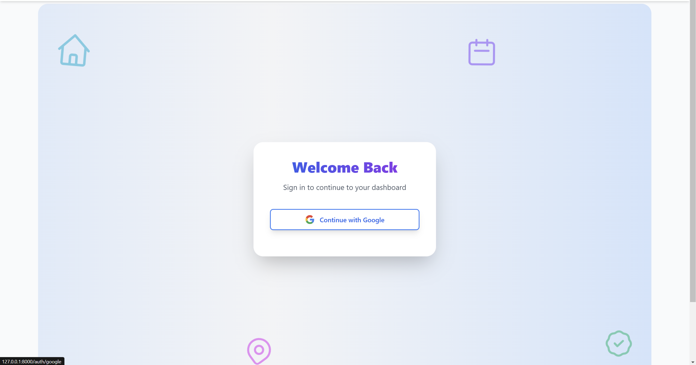
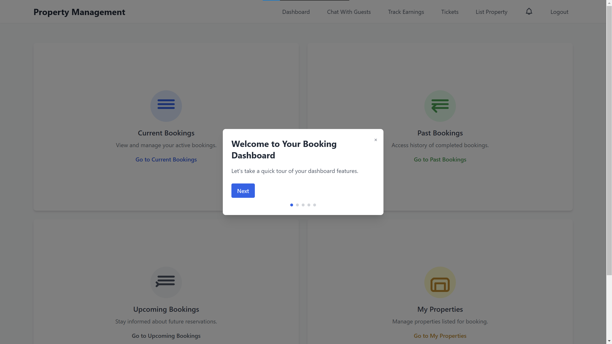
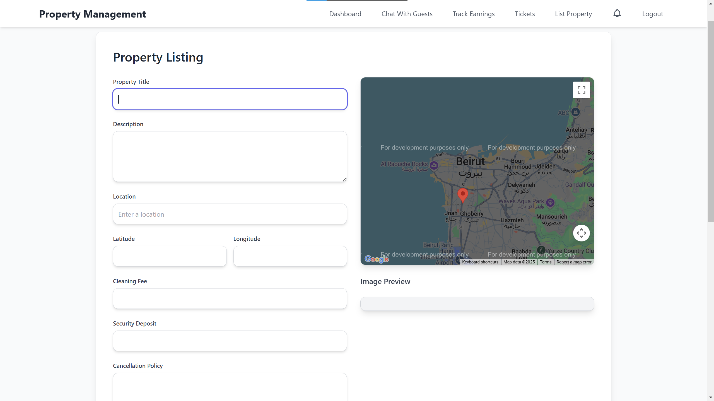
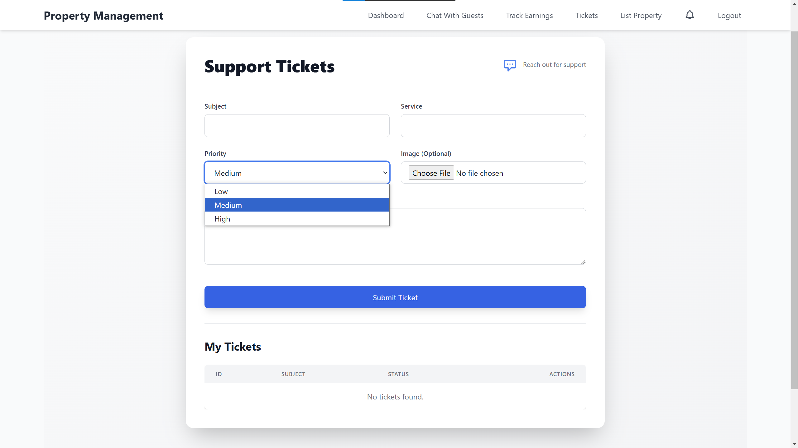
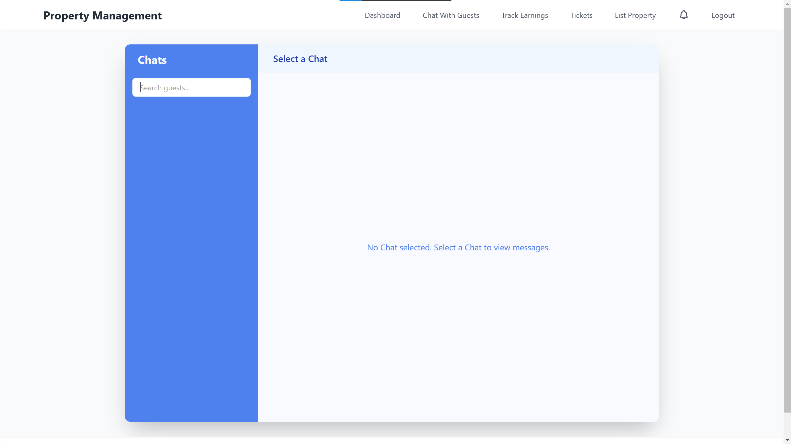
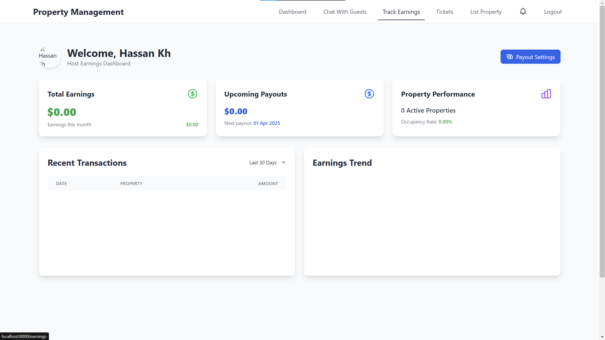
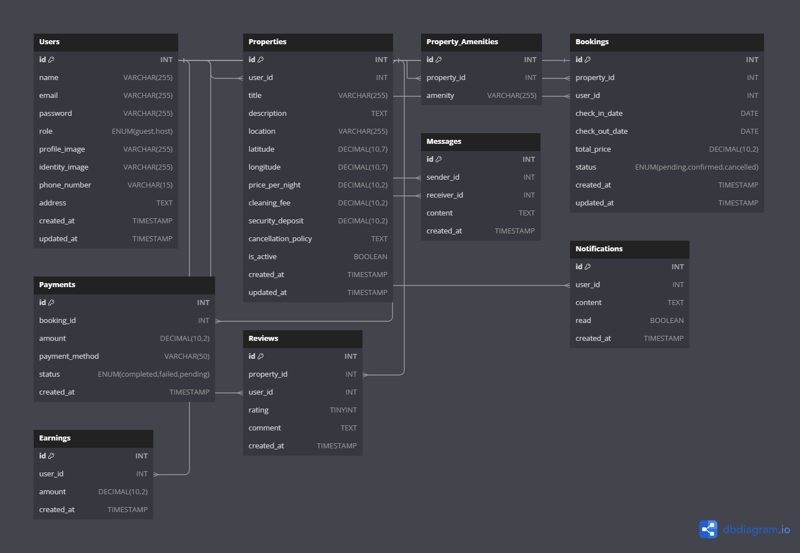

# Vacation Rental Platform - Host Application

## Project Overview

This Laravel-based vacation rental platform enables property owners (hosts) to list and manage their accommodations, handle bookings, and monitor earnings. The platform features an intuitive interface for property management, booking control, and guest communications.

## Table of Contents

- [Features](#features)
- [System Requirements](#system-requirements)
- [Installation](#installation)
- [Database Structure](#database-structure)
- [Authentication](#authentication)
- [Property Management](#property-management)
- [Booking Management](#booking-management)
- [Notifications and Messaging](#notifications-and-messaging)
- [Earnings and Payments](#earnings-and-payments)
- [Support System](#support-system)
- [API Documentation](#api-documentation)

## Features













### Host-Specific Features

- **Google Authentication**: Secure sign-in via Google accounts
- **Property Listing Management**: Create, update, and delete property listings with multiple photos
- **Calendar Management**: Control property availability through date ranges
- **Pricing Configuration**: Set nightly rates, cleaning fees, and security deposits
- **Booking Control**: Accept, reject, or automatically approve booking requests
- **Earnings Dashboard**: Track earnings, view payouts, and set payout preferences
- **Guest Communications**: Real-time chat with guests via Firebase
- **Support Ticketing System**: Submit and track support requests

## System Requirements

- PHP 8.0+
- Composer
- Laravel 8+
- MySQL 5.7+ or MariaDB 10.2+
- Node.js and NPM (for frontend assets)
- Firebase account (for real-time messaging)

## Installation

1. Clone the repository:
   ```bash
   git clone [your-repository-url]
   cd vacation-rental-platform
   ```

2. Install PHP dependencies:
   ```bash
   composer install
   ```

3. Install JavaScript dependencies:
   ```bash
   npm install && npm run dev
   ```

4. Create environment file:
   ```bash
   cp .env.example .env
   ```

5. Configure the .env file with your database and Firebase credentials:
   ```
   DB_CONNECTION=mysql
   DB_HOST=127.0.0.1
   DB_PORT=3306
   DB_DATABASE=your_database
   DB_USERNAME=your_username
   DB_PASSWORD=your_password

   FIREBASE_API_KEY=your-api-key
   FIREBASE_AUTH_DOMAIN=your-app.firebaseapp.com
   FIREBASE_DATABASE_URL=https://your-app.firebaseio.com
   FIREBASE_PROJECT_ID=your-app
   FIREBASE_STORAGE_BUCKET=your-app.appspot.com
   FIREBASE_MESSAGING_SENDER_ID=your-sender-id
   FIREBASE_APP_ID=your-app-id
   FIREBASE_MEASUREMENT_ID=your-measurement-id
   ```

6. Generate application key:
   ```bash
   php artisan key:generate
   ```

7. Run database migrations:
   ```bash
   php artisan migrate --seed
   ```

8. Start the development server:
   ```bash
   php artisan serve
   ```

## Database Structure

The platform uses the following key tables for host functionality:



### Users Table
Stores both guest and host user information:
```
id, name, email, google_id, role, profile_image, is_verified, phone_number, address, created_at, updated_at
```

### Properties Table
Stores all property listings information:
```
id, user_id, title, description, images_path, location, latitude, longitude, price_per_night, cleaning_fee, security_deposit, cancellation_policy, start_date, end_date, is_available, created_at, updated_at
```

### Amenities and Property_Amenities Tables
Manage property amenities:
```
amenities: id, amenity
property_amenities: id, property_id, amenity_id, created_at, updated_at
```

### Bookings Table
Manages all booking requests and statuses:
```
id, property_id, user_id, check_in_date, check_out_date, total_price, status (pending, confirmed, cancelled), created_at, updated_at
```

### Messages Table
Stores message history between hosts and guests:
```
id, sender_id, receiver_id, content, created_at
```

### Earnings Table
Tracks host earnings:
```
id, user_id, amount, created_at
```

### Tickets Table
Manages support requests:
```
id, user_id, subject, service, priority, message, image, status, date, created_at, updated_at
```

## Authentication

The platform uses Google OAuth for authentication:

1. Users sign in with their Google account
2. First-time users are prompted to complete their profile information
3. Users are assigned a role (host or guest)

```php
// Google OAuth routes
Route::get('auth/google', [GoogleController::class, 'redirectToGoogle'])->name('auth.google');
Route::get('auth/google/callback', [GoogleController::class, 'handleGoogleCallback']);
```

## Property Management

### Listing a Property

Hosts can create property listings with:
- Title and detailed description
- Location with Google Maps integration
- Multiple high-resolution images
- Pricing (nightly rate, cleaning fee, security deposit)
- Availability dates
- Amenities selection

```php
// Property routes
Route::get('/ListProperty',[PropertyController::class, 'listamenities']);
Route::post('/insertproperty',[PropertyController::class, 'insertproperty'])->name('insert.property');
Route::post('/upload-image', [PropertyController::class, 'uploadImage']);
Route::post('/delete-image', [PropertyController::class, 'deleteImage']);
```

### Managing Properties

Hosts can view, update, and delete their property listings:

```php
Route::get('/myproperties/{id}', [PropertyController::class, 'getuserproperties'])->name('myproperties');
Route::get('/update/{id}', /* Property update view */);
Route::put('/updating/{id}',[PropertyController::class, 'updateproperty'])->name('update.property');
Route::delete('/delete/{userid}/{propertyid}', /* Property deletion */);
```

## Booking Management

Hosts have full control over bookings with the ability to:

### Upcoming Bookings
- Confirm or reject new booking requests
- View details of upcoming stays

```php
Route::get('/upcoming-bookings', [BookingController::class, 'upcomingBookings'])->name('bookings.upcoming');
Route::post('/booking/{id}/confirm', [BookingController::class, 'confirmBooking'])->name('confirm.booking');
Route::post('/booking/{id}/cancel-upcoming', [BookingController::class, 'cancelUpcomingBooking'])->name('cancel.upcoming.booking');
```

### Current Bookings
- Manage currently active bookings
- Communicate with current guests

```php
Route::get('/current-bookings', [BookingController::class, 'currentBookings'])->name('current.bookings');
```

### Past Bookings
- View historical booking data and guest reviews

```php
Route::get('/past-bookings', [BookingController::class, 'pastBookings'])->name('bookings.past');
```

## Notifications and Messaging

### Real-time Notifications
The platform provides hosts with notifications for:
- New booking requests
- Booking confirmations or cancellations
- Guest messages
- System updates

```php
Route::get('/notifications', [NotificationController::class, 'showNotifications'])->name('notifications.index');
Route::post('/notifications/mark-as-read', [NotificationController::class, 'markNotificationAsRead'])->name('notifications.read');
Route::get('/notifications/unread', [NotificationController::class, 'fetchUnreadNotifications']);
```

### Guest Messaging System
The platform includes a Firebase-powered real-time messaging system:
- Chat with guests before, during, and after their stay
- Receive and respond to inquiries
- Share important information

The messaging system utilizes Firebase Realtime Database for instant communication.

## Earnings and Payments

Hosts can access their earnings dashboard to:
- View total earnings
- Track payments by booking
- Set preferred payout methods

```php
Route::get('/earnings', [EarningsController::class, 'index'])->name('earnings.dashboard');
Route::post('/earnings/update-payout-method', [EarningsController::class, 'updatePayoutMethod'])->name('earnings.update-payout-method');
```

## Support System

The platform includes a ticketing system for hosts to:
- Submit support requests
- Track ticket status
- Communicate with platform administrators

```php
Route::get('/tickets', [TicketController::class, 'index'])->name('tickets.index');
Route::post('/tickets', [TicketController::class, 'store'])->name('tickets.store');
Route::delete('/tickets/{id}', [TicketController::class, 'destroy'])->name('tickets.destroy');
```

## API Documentation

The platform exposes the following key API endpoints for potential integration:

### Properties
- `GET /api/properties` - List all properties
- `GET /api/properties/{id}` - Get property details
- `POST /api/properties` - Create a new property
- `PUT /api/properties/{id}` - Update a property
- `DELETE /api/properties/{id}` - Delete a property

### Bookings
- `GET /api/bookings` - List all bookings
- `GET /api/bookings/{id}` - Get booking details
- `POST /api/bookings/{id}/confirm` - Confirm a booking
- `POST /api/bookings/{id}/cancel` - Cancel a booking
